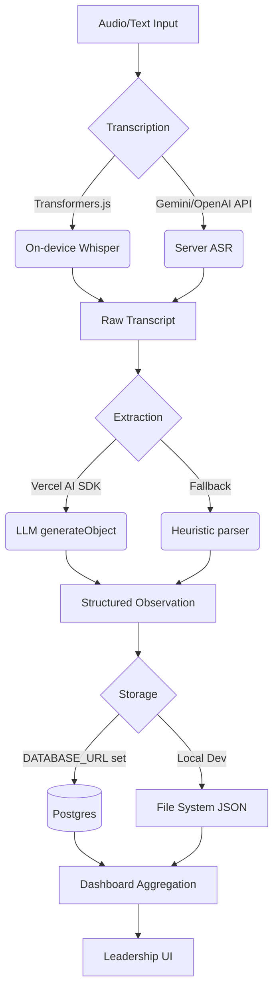

# Utah City Operational Intelligence - Architecture

This document provides a comprehensive overview of the architectural decisions, patterns, and structure of the Utah City tour feedback platform.

## 1. Directory Structure

The `src/` directory is organized into logical boundaries separating application routes, UI components, domain definitions, and backend services.

```text
src/
├── app/                  # Next.js App Router (pages, layouts, api, route groups)
├── components/           # React UI components (e.g., AppShell, MobileCaptureApp, Recorder)
├── domain/               # Domain logic, entity models, and shared type definitions
├── lib/                  # Shared utility functions and formatting helpers
├── server/               # Server-side logic (AI, auth, database repositories, email)
└── middleware.ts         # Edge middleware for authentication and RBAC routing
```

## 2. Route Groups

The Next.js App Router is divided into two primary route groups for role separation:

- **`(capture)`**: Serves the root `/` path. Contains the mobile capture interface used by **Tour Hosts**. It is lightweight and focuses on transcription and observation capture.
- **`(leadership)`**: Wraps all leadership routes (`/command`, `/analyst`, `/evidence`, `/journey`, `/operations`, `/settings`, `/signals`) within the global `AppShell`. Access to these routes is strictly restricted to users with the **leader** role.

## 3. Data Flow

The end-to-end data flow from raw audio capture to structured dashboard intelligence:



## 4. Repository Pattern

The application implements a dynamic Repository Pattern to abstract storage implementations. In `src/server/repositories/observations.ts`, a `usePg` boolean is evaluated based on the presence of `DATABASE_URL` (or related Postgres env vars). 

This allows the backend to automatically switch between:
- `postgres-observation-repository.ts`: Production-ready PostgreSQL storage using Prisma/pg.
- `file-observation-repository.ts`: Local fallback using the file system (JSON), enabling instant local development without a database.

## 5. AI Pipeline

The extraction and intelligence pipeline in `src/server/ai/model-config.ts` features a multi-provider fallback strategy:

- **LLM Routing Priority**: Google Gemini → Anthropic Claude → Vercel AI Gateway → Heuristic fallback.
- **Extraction**: Utilizes the Vercel AI SDK (`generateObject`) paired with Zod schemas to guarantee strongly-typed JSON payloads from unstructured transcripts.
- **Context Caching**: The AI Analyst leverages the Gemini Cached Content API for efficient prompt caching against the corpus.
- **ASR Fallback**: Employs client-side ASR via on-device Whisper (`transformers.js`) when server-side transcription is unavailable.

## 6. Authentication & RBAC

The platform utilizes a secure, custom authentication strategy:

- **Session Tokens**: Uses HMAC-SHA256 to sign stateless session tokens stored in the `uc_session` cookie (`src/server/auth/session.ts`).
- **Password Hashing**: Implements PBKDF2 with 100,000 iterations for secure credential storage (`src/server/auth/crypto.ts`).
- **Invitations**: Generates cryptographically signed invitation tokens to authorize account creation.
- **Middleware**: `src/middleware.ts` enforces Role-Based Access Control (RBAC). It isolates public routes, redirects unauthorized hosts away from leadership views, and injects session data (`x-user-id`, `x-user-role`, `x-user-name`, `x-user-email`) securely into request headers.

## 7. Email Relay

A sophisticated bidirectional support email proxy is implemented in `src/app/api/webhooks/resend/route.ts`:

1. **Inbound**: A customer emails `support@utahcity.app`. The Resend webhook intercepts it and forwards it to the primary support inbox (`jawoba004@gmail.com`).
2. **Encoding**: The webhook injects a custom `reply+<encoded_customer_email>@utahcity.app` reply-to header.
3. **Outbound**: When the support operator replies, the webhook intercepts the outbound message, decodes the customer's email from the `reply+` address, and routes it to the customer, ensuring all communication appears to originate from `support@utahcity.app`.

## 8. Component Hierarchy

An overview of how page layouts and primary components map out:

```mermaid
flowchart TD
  Root[Root Layout] --> CaptureG[(capture) Route Group]
  Root --> LeaderG[(leadership) Route Group]
  
  CaptureG --> MobileApp[MobileCaptureApp <br/><i>(page.tsx)</i>]
  MobileApp --> Recorder[Recorder]
  MobileApp --> CaptureForm[CaptureForm]
  
  LeaderG --> AppShell[AppShell <br/><i>(layout.tsx)</i>]
  AppShell --> Command[Command Dashboard]
  AppShell --> Analyst[AI Analyst]
  AppShell --> Evidence[Evidence Explorer]
  AppShell --> Journey[Journey View]
  AppShell --> Operations[Operations View]
  AppShell --> Settings[Settings UI]
```
